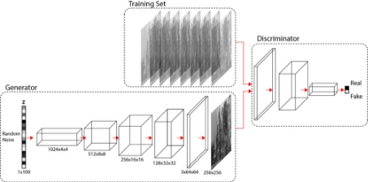
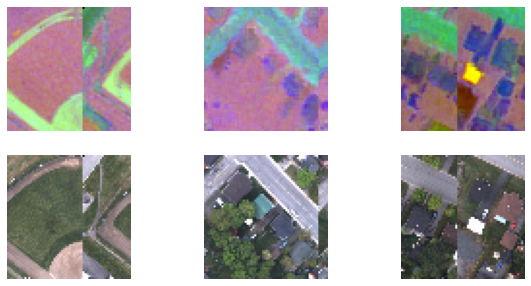
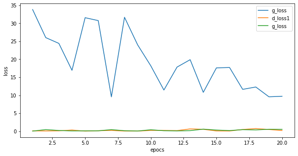


# Abstract:
The aim of this research is to study the capability of adversarial-generative convolutional neural networks in translating hyperspectral LWIR images to their visible RGB counterparts. The IGARSS 2014 dataset, which includes hyperspectral and corresponding visible images, is utilized in this study. The significance of this research lies in the possibility of employing existing classifiers for visible spectra in other spectra as well. Moreover, it can be highly practical in interpreting such images.

Keywords: Convolutional neural networks, GAN, CGAN, Pix2Pix

# Introduction:
Many problems in image processing can be considered as the "translation" of an input image into an equivalent output image, similar to how a text can be expressed in either Persian or English. A scene can be represented with an RGB or infrared image, even though each may possess information that the other lacks, but their origin remains the same (Zhu et al., 2017).

With the advancements in remote sensing systems and access to multi-sensor information, the research community strives to achieve better results in image classification by utilizing various sensors (Abdi et al., 2017). Images captured in new spectra provide complementary data about a scene, leading to advantages over images restricted to a specific band.

In this article, we aim to translate LWIR (Long-Wave Infrared) images into RGB images using GAN (Generative Adversarial Network) networks. Considering the human eye's familiarity with the visible spectrum, such translation can greatly facilitate the interpretation of LWIR images for non-expert users (Reyes et al., 2019).

Additionally, LWIR hyperspectral data faces challenges such as low energy, low SNR (Signal-to-Noise Ratio), high inter-band correlation, and unclear boundaries, which can hinder classification. On the other hand, visible data provide details but suffer from limited spectral resolution, making it difficult to distinguish objects with homogeneous spectra.

A common misconception about GANs is how they generate information that does not exist. The answer lies in the fact that these networks learn patterns after observing millions of images and then utilize that knowledge on other trained datasets, thereby adding to our information (Ledig et al., 2016). Similar to our human brains, which, after seeing thousands of fruits, can make a reasonably accurate guess about the shape of an orange.

For example, Wang and Patel (2018) employed GANs to translate SAR (Synthetic Aperture Radar) images into RGB and obtained good results.

*Figure 1Conversion of Radar to Color Image (Wang & Patel, 2018)*

In general, the working principle of GANs (Generative Adversarial Networks) is as follows: they take an input, which can be random noise (Goodfellow et al., 2014) or a conditional value known as CGAN (Mirza & Osindero, 2014). This condition can also be an image (Isola et al., 2016).

The generator network aims to transform this input into an output, such as a human face. On the other hand, the discriminator network's task is to determine whether the given image is real or generated (fake) by the generator network.

*Figure 2. GAN Architecture*

*Figure 3. Diffrence between GAN and cGAN*
# Chapter 2: Background Concepts and Literature Review
In the early stages, GANs were introduced in 2014 by Goodfellow et al. Shortly after, one of the authors of the original paper, Mirza and Osindero, introduced CGAN (Conditional GAN) by adding a conditioning input to the model.

Figure 5: Generation of random numbers or random faces using GAN (Goodfellow et al., 2014).

Figure 6: Generation of images of digits 0 to 9 selected by the user using CGAN (Mirza & Osindero, 2014).

However, a significant breakthrough in these networks came with the introduction of the pix2pix network by Isola et al. in 2016. The architecture of pix2pix was initially released on GitHub and later found numerous applications with the help of users, eventually leading to a formal research paper.

Figure 7: Translation from mask to real image using pix2pix (Isola et al., 2016).

Figure 8: Conversion from RGB image to Google Map representation.

Figure 9: Conversion from grayscale to color image.

In general, the pix2pix network consists of a generator, based on the UNET architecture, and a discriminator, which is a siamese classifier.

Figure 10: Structure of pix2pix.

An image is fed into the generator (G), which produces a mask. The mask, along with the real image, is then inputted into the discriminator (D) to determine whether it is a real or fake image. If the discriminator makes a correct guess, the generator adjusts itself using binary cross-entropy loss. If it makes a mistake, the generator corrects itself.

Two papers (Reyes et al., 2019; Wang & Patel, 2018) utilized CGANs for transforming SAR (Synthetic Aperture Radar) images to RGB.

Figure 10: SAR2Optic.

(Liu et al., 2018) employed CGANs for transforming thermal images to visible images.

Figure 10: IR2VIS.

# 3- Data Augmentaion
Data augmentation plays a crucial role in addressing the overfitting issue in convolutional neural networks (CNNs), which are prone to overfitting due to limited training data availability (Shorten & Khoshgoftaar, 2019).

Data augmentation is a technique used to generate new training data by applying various image transformations to the existing dataset. Some of the simplest augmentation methods include rotation, flipping, and contrast adjustment.

Another approach is to create new images by combining linear and nonlinear transformations of existing images. This involves breaking down images into smaller pieces and reassembling them in different combinations.

Data augmentation helps in diversifying the training dataset, providing the neural network with more examples to learn from and reducing the risk of overfitting. By introducing variations in the training data, the network becomes more robust and better generalizes to unseen data.

# Chapter 3: Work Method
In this chapter, based on the knowledge obtained in the previous chapter, we preprocess our images and design our system model to see if we achieve satisfactory results or not.

## 1-3 Data Preparation
### 1-1-3 Used Data
The used data consists of a visible RGB image with a pixel size of 0.2 meters and a hyperspectral LWIR image with a spatial resolution of 1 meter, which has 84 bands from 7.8 micrometers to 11.5 micrometers (The 2014 IEEE GRSS Data Fusion Contest, n.d.).

Figure 16: LWIR Image Bands in ENVI

To reduce dimensions, we employed two algorithms, PCA and ICA, ultimately using PCA from the first to the seventh band.

It should be noted that to make our solution more comprehensive, it would have been better to use band averaging and band selection instead.

We also downsampled the visible data to 1 meter by 1 meter to match the size of LWIR.

Figure 17: PC1-PC7

In the next step, in order to have consistent images for training the network and considering the presence of gaps between visible flight lines, we needed to mask the LWIR image. For this purpose, a mask was created from the RGB image, where the mask was 0 wherever all pixel values of the three bands were 0, and 1 otherwise. Then, the mask was applied to the LWIR image.

### 3-1-3 Image Patching
In the next stage, we divided the images into patches of size (64, 64, 7) and (64, 64, 3) with an overlap of 8 pixels using the patchify library. Since the original image size was 751 by 874 pixels, we obtained approximately 200 images.

Figure 18: Images after Patching

3-1-3 Data Augmentation

As mentioned in Chapter 2, we use rotation, flip, and linear mixing methods to generate new images. However, to ensure that we only augment data with actual content, we exclude images and their corresponding masks where the percentage of mask pixels with a value of 1 is less than 5%, as this threshold was determined empirically.

Afterwards, we create 500 augmented images.

Figure 19: Example of Augmented Image

### 2-3 Network Architecture
In the main architecture, images with a size of 256x256 were initially used, and in both the G and D networks, the images were downsampled 5 times with a stride of 2. Since our images are 64 by 64, we had to adjust the network accordingly by removing the last 2 layers of G and D. Additionally, unlike the original model where both input and output are 3-band images, our input image has 7 bands and the output has 3 bands, which should be considered in the concatenation steps.

The overall architecture is as follows:

Figure 21: Network Architecture
## Chapter 4: Results
In this chapter, we examine the results of our work.
### 4-1-1 Error Rate:
Overall, there is still no specific criterion for the accuracy and correctness of GANs because, for example, if it generates a house with a blue roof while the actual roof is green, but our goal is to find houses, it can be considered correct.

However, in general, Binary Cross Entropy for D and Mean Absolute Error for G are relatively suitable metrics. In the results, we observe a good progress until epoch 65, but visually, the best generation is seen at epoch 35.

### 4-1-1 Final Results:
The final results indicate that the network can fit well to the training data but does not perform well during testing, and the reason is clear: insufficient training data!

The minimum training data I have observed is 1000 images of size 256 by 256. If we wanted to bring our data to this size, we would need a total of 8 to 10 tiles!

Although great efforts have been made for augmentation.

Figure 23: Testing at epoch 15

Figure 24: Training at epoch 15

(a)

(b)

Figure 25: (a): Training | (b): Testing after 25 epochs

Figure 25: (a): Training | (b): Testing after 25 epochs

## 1-5. Conclusion:
Considering the very limited training data, the results are truly promising and give hope that with more images, a nearly flawless model can be achieved. The network has successfully understood the roads and has become familiar with the concept of houses, but it is evident that the lack of training data has confused the colors. The distinction between trees and grass has been challenging, but overall, it has performed well in plant detection. RGB classifiers can also be used on this data.

In this study, we have demonstrated that although the training data was limited compared to other research, by utilizing appropriate augmentation methods, we can prevent overfitting.
##
## 2-5. Future work:
During my research, I came across several aerial campaigns by NASA and the European Space Agency. Unfortunately, I didn't have the opportunity to investigate them thoroughly. If we can obtain corresponding thermal and RGB data for large-scale areas with high resolution, we can definitely achieve a robust model.

Abdi, G., Samadzadegan, F., & Reinartz, P. (2017). A decision-based multi-sensor classification system using thermal hyperspectral and visible data in urban area. *European Journal of Remote Sensing*, *50*(1), 414–427. https://doi.org/10.1080/22797254.2017.1348914

Goodfellow, I. J., Pouget-Abadie, J., Mirza, M., Xu, B., Warde-Farley, D., Ozair, S., Courville, A., & Bengio, Y. (2014). *Generative Adversarial Networks*. http://arxiv.org/abs/1406.2661

Isola, P., Zhu, J.-Y., Zhou, T., & Efros, A. A. (2016). *Image-to-Image Translation with Conditional Adversarial Networks*. http://arxiv.org/abs/1611.07004

Ledig, C., Theis, L., Huszar, F., Caballero, J., Cunningham, A., Acosta, A., Aitken, A., Tejani, A., Totz, J., Wang, Z., & Shi, W. (2016). *Photo-Realistic Single Image Super-Resolution Using a Generative Adversarial Network*. http://arxiv.org/abs/1609.04802

Liu, S., John, V., Blasch, E., Liu, Z., & Huang, Y. (2018). *IR2VI: Enhanced Night Environmental Perception by Unsupervised Thermal Image Translation*. http://arxiv.org/abs/1806.09565

Mino, A., & Spanakis, G. (2018). *LoGAN: Generating Logos with a Generative Adversarial Neural Network Conditioned on color*. http://arxiv.org/abs/1810.10395

Mirza, M., & Osindero, S. (2014). *Conditional Generative Adversarial Nets*. http://arxiv.org/abs/1411.1784

O’Shea, K., & Nash, R. (2015). *An Introduction to Convolutional Neural Networks*. http://arxiv.org/abs/1511.08458

Reyes, M. F., Auer, S., Merkle, N., Henry, C., & Schmitt, M. (2019). SAR-to-optical image translation based on conditional generative adversarial networks-optimization, opportunities and limits. *Remote Sensing*, *11*(17). https://doi.org/10.3390/rs11172067

Ronneberger, O., Fischer, P., & Brox, T. (2015). *U-Net: Convolutional Networks for Biomedical Image Segmentation*. http://arxiv.org/abs/1505.04597

Shorten, C., & Khoshgoftaar, T. M. (2019). A survey on Image Data Augmentation for Deep Learning. *Journal of Big Data*, *6*(1). https://doi.org/10.1186/s40537-019-0197-0

*The 2014 IEEE GRSS Data Fusion Contest*. (n.d.).

Wang, P., & Patel, V. M. (2018). *Generating High Quality Visible Images from SAR Images Using CNNs*. http://arxiv.org/abs/1802.10036

Zhu, J.-Y., Park, T., Isola, P., & Efros, A. A. (2017). *Unpaired Image-to-Image Translation using Cycle-Consistent Adversarial Networks*. http://arxiv.org/abs/1703.10593

